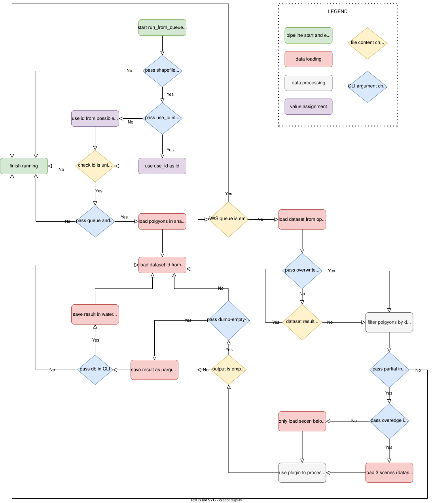
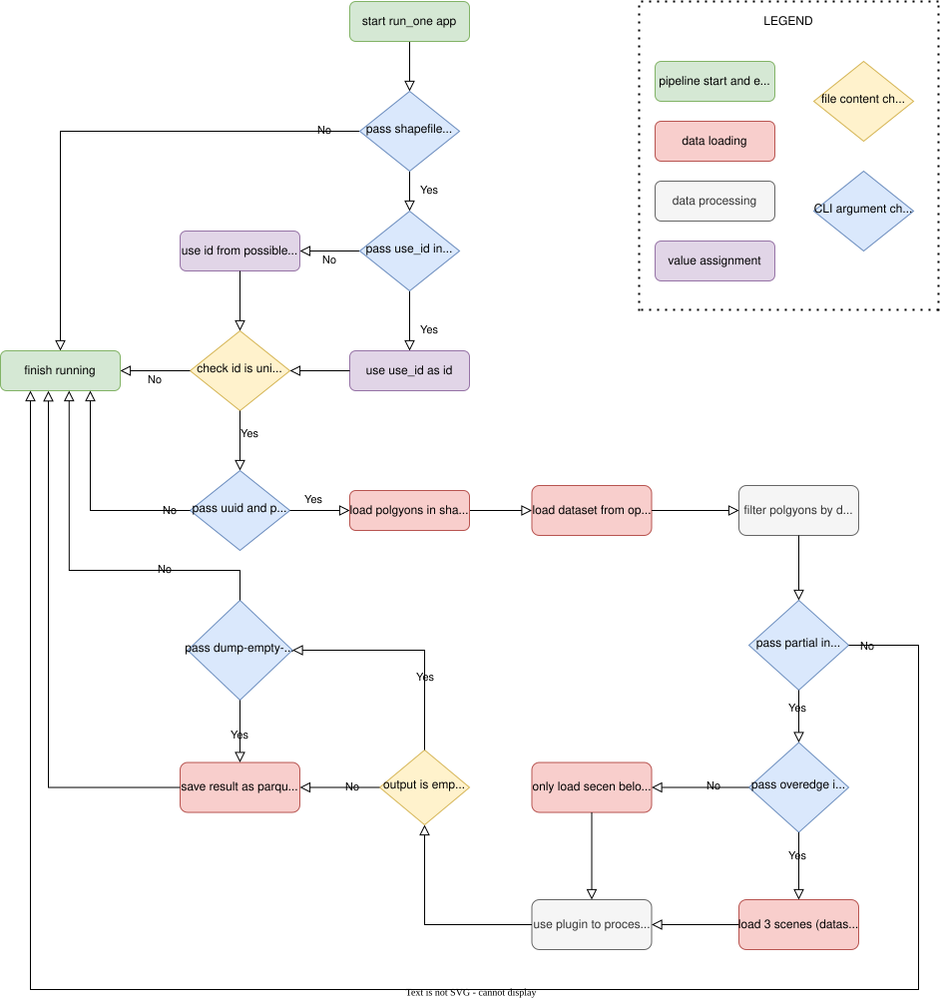

# DEA Conflux


[](https://github.com/GeoscienceAustralia/dea-conflux/actions/workflows/test.yml) [](https://github.com/GeoscienceAustralia/dea-conflux/actions/workflows/lint.yml) [](https://hub.docker.com/r/geoscienceaustralia/dea-conflux)
[](https://app.codecov.io/gh/GeoscienceAustralia/dea-conflux)

This is a prototype tool for processing bulk polygon drills.

- License: Apache 2.0
- Contact:
  bex.dunn@ga.gov.au
  abeer.mahendroo@ga.gov.au
  earth.observation@ga.gov.au (subject: Attn Inland Water)

## Installation

Install with `pip`:

```bash
pip install git+https://github.com/GeoscienceAustralia/dea-conflux.git
```

Or clone the repository and install from the local version.

```bash
git clone https://github.com/GeoscienceAustralia/dea-conflux.git
cd dea-conflux
pip install -e .
```

## Usage

Conflux provides a command-line tool `dea-conflux` for running each step of the polygon drill. Descriptions of the commands are available with `dea-conflux --help`. Conflux requires a Datacube configuration to work.

### `run-one`

Run a polygon drill on a single scene.

```bash
dea-conflux run-one --plugin PLUGIN_PATH --uuid SCENE_ID --shapefile SHAPEFILE_PATH --output OUTPUT_PATH [OPTIONS]
```

| Flag | Short | Default | Description |
|---|---|---|---|
| `--plugin` | `-p` | required | Path to Conflux plugin (`.py`). |
| `--uuid` | `-i` | required | ID of scene to process. |
| `--shapefile` | `-s` | required | Path to the polygon shapefile to run polygon drill on. |
| `--output` | `-o` | required | Path to the output directory. |
| `--use-id` | `-u` | auto-detected | Unique key ID field in shapefile. |
| `--partial/--no-partial` | | `--partial` | Include polygons that only partially intersect the scene. |
| `--overedge/--no-overedge` | | `--overedge` | Include data from over the scene boundary. |
| `--dump-empty-dataframe/--not-dump-empty-dataframe` | | `--dump-empty-dataframe` | Always write an output Parquet file, even if the DataFrame is empty. |
| `--verbose` | `-v` | off | Increase logging verbosity (use `-v` or `-vv`). |

### `run-from-queue`

Run a polygon drill on scenes from an AWS SQS queue. Messages must be the UUID of a scene.

```bash
dea-conflux run-from-queue --plugin PLUGIN_PATH --queue QUEUE_NAME --shapefile SHAPEFILE_PATH --output OUTPUT_PATH [OPTIONS]
```

| Flag | Short | Default | Description |
|---|---|---|---|
| `--plugin` | `-p` | required | Path to Conflux plugin (`.py`). |
| `--queue` | `-q` | required | Queue to read IDs from. |
| `--shapefile` | `-s` | required | Path to the polygon shapefile to run polygon drill on. |
| `--output` | `-o` | required | Path to the output directory. |
| `--use-id` | `-u` | auto-detected | Unique key ID field in shapefile. |
| `--partial/--no-partial` | | `--partial` | Include polygons that only partially intersect the scene. |
| `--overedge/--no-overedge` | | `--overedge` | Include data from over the scene boundary. |
| `--overwrite/--no-overwrite` | | `--no-overwrite` | Rerun scenes that have already been processed. |
| `--dump-empty-dataframe/--not-dump-empty-dataframe` | | `--dump-empty-dataframe` | Always write an output Parquet file, even if the DataFrame is empty. |
| `--timeout` | | `1080` | Seconds a received SQS message is invisible. |
| `--db/--no-db` | | `--db` | Write results to the Waterbodies database. |
| `--verbose` | `-v` | off | Increase logging verbosity (use `-v` or `-vv`). |

### `nrt-run-from-queue`

Run a polygon drill in Near Real Time mode from an AWS SQS queue, with immediate CSV output.

```bash
dea-conflux nrt-run-from-queue --plugin PLUGIN_PATH --queue QUEUE_NAME --shapefile SHAPEFILE_PATH --output OUTPUT_PATH --csv-output CSV_OUTPUT_PATH [OPTIONS]
```

| Flag | Short | Default | Description |
|---|---|---|---|
| `--plugin` | `-p` | required | Path to Conflux plugin (`.py`). |
| `--queue` | `-q` | required | Queue to read IDs from. |
| `--shapefile` | `-s` | required | Path to the polygon shapefile to run polygon drill on. |
| `--output` | `-o` | required | Path to the output directory. |
| `--csv-output` | | required | Output directory for Waterbodies-style CSVs. |
| `--use-id` | `-u` | auto-detected | Unique key ID field in shapefile. |
| `--partial/--no-partial` | | `--partial` | Include polygons that only partially intersect the scene. |
| `--overedge/--no-overedge` | | `--overedge` | Include data from over the scene boundary. |
| `--overwrite/--no-overwrite` | | `--no-overwrite` | Rerun scenes that have already been processed. |
| `--dump-empty-dataframe/--not-dump-empty-dataframe` | | `--dump-empty-dataframe` | Always write an output Parquet file, even if the DataFrame is empty. |
| `--timeout` | | `1080` | Seconds a received SQS message is invisible. |
| `--db/--no-db` | | `--db` | Write results to the Waterbodies database. |
| `--jobs` | `-j` | `8` | Number of workers for CSV generation. |
| `--index-num` | `-i` | `0` | Waterbodies ID chunk index (used with `--split-num`). |
| `--split-num` | | `1` | Number of chunks to split the overall waterbodies ID list into. |
| `--remove-duplicated-data/--no-remove-duplicated-data` | | `--remove-duplicated-data` | Remove duplicate timeseries data. |
| `--verbose` | `-v` | off | Increase logging verbosity (use `-v` or `-vv`). |

### `filter-from-queue`

Read scene IDs from one SQS queue, filter them by shapefile intersection, and push matching IDs to another queue.

```bash
dea-conflux filter-from-queue --input-queue INPUT_QUEUE --output-queue OUTPUT_QUEUE --shapefile SHAPEFILE_PATH [OPTIONS]
```

| Flag | Short | Default | Description |
|---|---|---|---|
| `--input-queue` | `-iq` | required | Queue to read all IDs from. |
| `--output-queue` | `-oq` | required | Queue to save filtered IDs to. |
| `--shapefile` | `-s` | required | Path to the polygon shapefile to filter datasets by. |
| `--use-id` | `-u` | auto-detected | Unique key ID field in shapefile. |
| `--timeout` | | `3600` | Seconds a received SQS message is invisible. |
| `--num-worker` | | `4` | Number of processes to filter datasets. |
| `--verbose` | `-v` | off | Increase logging verbosity (use `-v` or `-vv`). |

### `get-ids`

Find and print dataset IDs matching a search expression, optionally filtering by shapefile.

```bash
dea-conflux get-ids PRODUCT [EXPRESSIONS] [OPTIONS]
```

| Flag | Short | Default | Description |
|---|---|---|---|
| `PRODUCT` | | required | Datacube product name to search. |
| `--shapefile` | `-s` | none | Path to shapefile to spatially filter datasets. |
| `--use-id` | `-u` | auto-detected | Unique key ID field in shapefile. |
| `--s3/--stdout` | | `--stdout` | Write output to S3 instead of stdout. |
| `--num-worker` | | `4` | Number of processes for filtering. |
| `--bucket-name` | | `dea-public-data-dev` | S3 bucket for output when using `--s3`. |
| `--verbose` | `-v` | off | Increase logging verbosity (use `-v` or `-vv`). |

### `stack`

Stack Parquet outputs from `run-one` or `run-from-queue` into other formats.

```bash
dea-conflux stack --parquet-path PARQUET_PATH [OPTIONS]
```

| Flag | Short | Default | Description |
|---|---|---|---|
| `--parquet-path` | | required | Path to the Parquet directory. |
| `--output` | | none | Output directory for waterbodies-style stack. |
| `--pattern` | | `.*` | Regular expression for filename matching. |
| `--mode` | | `waterbodies` | Output mode: `waterbodies`, `waterbodies_db`, or `wit_tooling`. |
| `--drop/--no-drop` | | `--no-drop` | Drop the database before writing (only applies to `waterbodies_db` mode). |
| `--remove-duplicated-data/--no-remove-duplicated-data` | | `--remove-duplicated-data` | Remove duplicate timeseries data. |
| `--verbose` | `-v` | off | Increase logging verbosity (use `-v` or `-vv`). |

### `package-delivery`

Concatenate all polygon-based CSV files into a single CSV and single Parquet file for delivery.

```bash
dea-conflux package-delivery --csv-path CSV_PATH --output OUTPUT_PATH [OPTIONS]
```

| Flag | Short | Default | Description |
|---|---|---|---|
| `--csv-path` | | required | Path to the polygon base (CSV files) result directory. |
| `--output` | | required | Output directory for single-file delivery. |
| `--precision` | | `4` | Decimal precision for rounding output values. |
| `--verbose` | `-v` | off | Increase logging verbosity (use `-v` or `-vv`). |

### `db-to-csv`

Export Waterbodies-style CSVs from the database.

```bash
dea-conflux db-to-csv --output OUTPUT_PATH --shapefile SHAPEFILE_PATH [OPTIONS]
```

| Flag | Short | Default | Description |
|---|---|---|---|
| `--output` | | required | Output directory for Waterbodies-style CSVs. |
| `--shapefile` | `-s` | required | Path to the polygon shapefile. |
| `--jobs` | `-j` | `8` | Number of workers. |
| `--index-num` | `-i` | `0` | Waterbodies ID chunk index (used with `--split-num`). |
| `--split-num` | | `1` | Number of chunks to split the overall waterbodies ID list into. |
| `--remove-duplicated-data/--no-remove-duplicated-data` | | `--remove-duplicated-data` | Remove duplicate timeseries data. |
| `--verbose` | `-v` | off | Increase logging verbosity (use `-v` or `-vv`). |

### `push-to-queue`

Push lines from a text file as messages to an AWS SQS queue.

```bash
dea-conflux push-to-queue --txt TXT_PATH --queue QUEUE_NAME [OPTIONS]
```

| Flag | Short | Default | Description |
|---|---|---|---|
| `--txt` | | required | Path to the TXT file to push to the queue. |
| `--queue` | | required | Queue name to push to. |
| `--verbose` | `-v` | off | Increase logging verbosity (use `-v` or `-vv`). |

### `make`

Create an AWS SQS queue (and a corresponding dead-letter queue).

```bash
dea-conflux make QUEUE_NAME [OPTIONS]
```

| Flag | Short | Default | Description |
|---|---|---|---|
| `NAME` | | required | Name of the queue to create. |
| `--timeout` | | `1080` | Visibility timeout in seconds. |
| `--retention-period` | | `604800` (7 days) | Message retention period in seconds. |
| `--retries` | | `5` | Number of retries for AWS API calls. |

### `delete`

Delete an AWS SQS queue and its associated dead-letter queue.

```bash
dea-conflux delete QUEUE_NAME
```

| Flag | Short | Default | Description |
|---|---|---|---|
| `NAME` | | required | Name of the queue to delete. |

Note:

The dea-conflux only allows to run on `partial` mode right now. The polygons which partial overlap with the scene will also be processed.

## Plugins

A plugin defines the inputs and outputs of a polygon drill. It is a Python file with the extensions `.conflux.py`. Examples are provided in the `examples/` directory.

Plugins must provide:

- a product name for the drill,
- a version string for the drill,
- the resampling method to use on input rasters,
- the CRS to project the input rasters into,
- the resolution to resample the input rasters into,
- a dictionary of input products and bands,
- a transform function, and
- a summarise function.

#### Transform function
The transform is run to produce rasters to summarise and should contain operations like masking and band index calculation.
Transform will be applied to the whole scene, not to a polygon if you are using a polygon.

#### Summarise function
The summarise function aggregates a dataset into a number of measurements that summarise a polygon, i.e. the outputs of the drill.
Summarise is applied to just the pixels in the polygon.

## Pre-commit setup

	❯ pip install pre-commit
	❯ pre-commit install

Your code will now be formatted and validated before each commit by running `pre-commit run -a`

## The run-from-queue processing pipeline

The dea-conflux has two main processing functions. The `run_one` designs to do the local test and the `run_from_queue` design to run big scale processing. The `run_from_queue` needs a queue system as backend. We are using the [AWS SQS queue](https://aws.amazon.com/sqs/) as example.



## The run_one processing pipeline

The `run_one` feature designs to do the single scene processing. The user have to provide the expected scene UUID in opendatacube.


